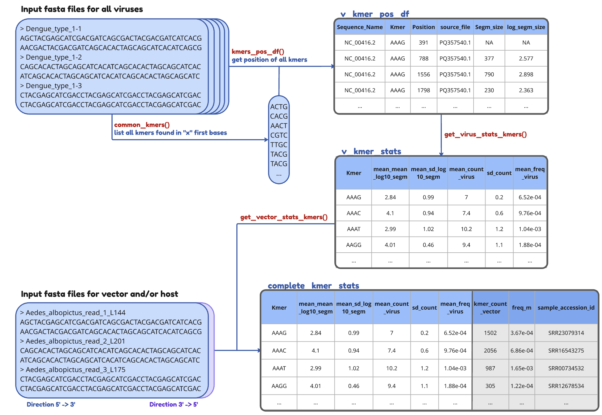

# KmerEnrich

KmerEnrich is an R package for analyzing k-mer enrichment in viral and vector genomes. This tool helps researchers identify and analyze common k-mers (k-length nucleotide sequences) across multiple genomic sequences, particularly useful for studying virus-vector interactions.

## Features

- **Common K-mer Analysis**: Generate lists of common k-mers found in all sequences of FASTA files
- **Position Analysis**: Track the position and distribution of k-mers across sequences
- **Enrichment Analysis**: Compare k-mer frequencies between viral and vector genomes
- **Statistical Analysis**: Calculate comprehensive statistics including:
  - Frequency of k-mer appearances
  - Mean segment separation distances
  - Standard deviation of k-mer distributions
  - K-mer count statistics
- **HTML Report Generation**: Create detailed reports with visualizations of results

## Installation

```R
# Install KmerEnrich (from GitHub) using devtools
devtools::install_github("Miloumille/KmerEnrich")
```

## Usage

### Main Functions
#### Basic K-mer Analysis

```R
# Generate common k-mers from a single FASTA file
k_mers <- gen_obs_kmers_one_fasta("path/to/virus.fasta", k = 4, x = 20)

# Generate common k-mers from a directory of FASTA files
k_mers <- gen_obs_kmers_one_fasta("path/to/dengue/directory/", k = 4, x = 100)
```

#### Position Analysis

```R
# Generate position dataframe for k-mers
positions_df <- kmers_pos_df(fasta_path = "path/to/sequences", kmers_list = k_mers)
```

#### Statistical Analysis

```R
# Get virus statistics
virus_stats <- get_virus_stats_kmers(df_virus)

# Get vector statistics
vector_stats <- get_vector_stats_kmers(v_kmers_stats, vector_genome_path)
```

## Generate HTML Report of main analysis
This report will include all previous steps and plot graph that will help visualize the results of different Kmer sizes for specific or generic analysis for one or multiple vector fastq files.

The HTML report will contain a main dataframe of the get_vector_stats_kmers function for each selected Kmer size. 
For each k (size) the HTML report will also plot a graph of the renchirment versus repartition of the Kmer on the viral genome. allowing for easier comparison of Kmers
finally the report will also show the position of the 5 best Kmers on the viral genome.
This allows for deeper analysis on for genome coverage.
```R
# Generate full enrichment report for mutiple kmers
KmerEnrichFullReport(virus_folder, vector_genome_path, k, x,"my_report.html")
```

## Output

The package generates various outputs including:
- Lists of common k-mers
- Position information for each k-mer
- Statistical summaries
- Enrichment analysis results
- Visual reports showing k-mer distribution and enrichment

## Dependencies

- R (>= 3.5.0)
- Biostrings
- rmarkdown

## Structured image of the Pipeline



## Contributing

Contributions are welcome! Please feel free to submit a Pull Request.

## Contact

milouvancau@gmail.com
